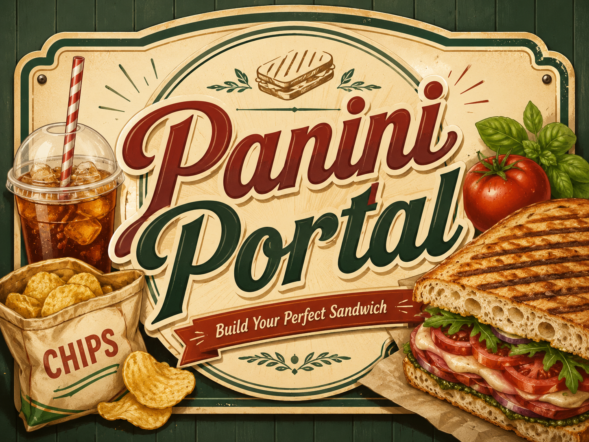
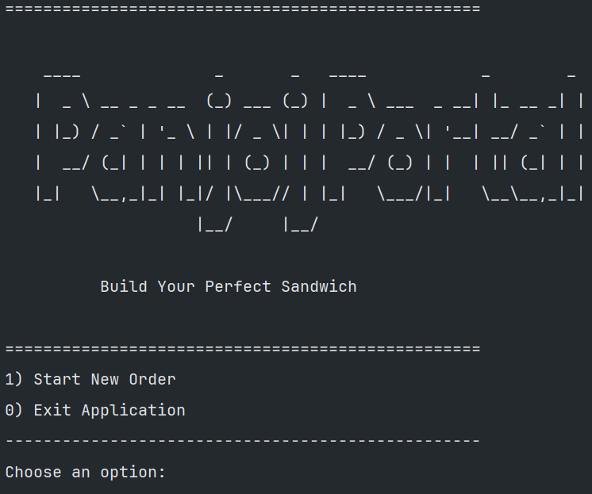
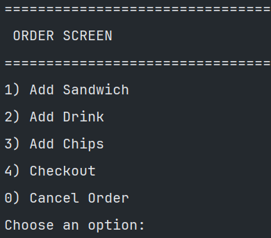
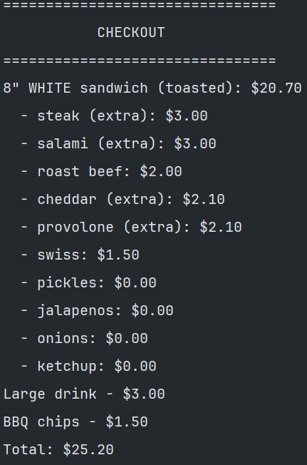

# Panini Portal

## Description
A console-based deli ordering application that allows users to build sandwiches, add drinks and chips, checkout, and save receipts.


## Features

- Add custom sandwiches
- Add drinks
- Add chips
- View checkout receipt
- Save receipt to file

## How to Run
1. Open the project in IntelliJ
2. Run `Program.java`

## Project Structure

```text
src/main/java/com/pluralsight
├── models
│   ├── Order.java
│   ├── Sandwich.java
│   ├── Drink.java
│   ├── Chips.java
│   ├── Topping.java
│   └── OrderItem.java
├── ui
│   └── UserInterface.java
├── util
│   └── ReceiptFileManager.java
└── Program.java
```
```md
- `models` contains the main business objects used in the order.
- `ui` handles menu screens and user input.
- `util` handles saving receipt files.
- `Program.java` starts the application.
```

## Screenshots


